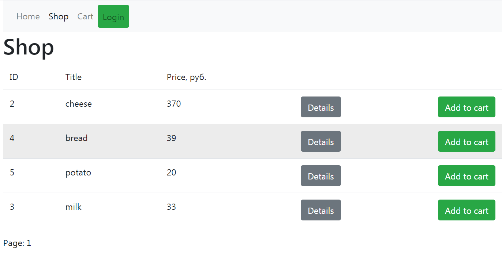

# Spring Store 🍃
[spring-store-tko.herokuapp.com](https://spring-store-tko.herokuapp.com/)

### Прототип интернет-магазина

Pages: home, shop, authorization, orders.

There are four roles in the system: Guest, User, Administrator, Seller.

- Guest (authorization is not required)\
Can view products in the store and information about them, add products to the cart.

- User (login required)\
Can do the same as the guest. Also place an order. View a list of your orders and cancel them.\
Login: Renat, password: far 

- Administrator (login required)\
Can do the same as the user. And also remove items from the store.

- Seller (login required)\
Can do the same as the user. And also see the orders of all users and cancel them.\
Login: Dina, password: cola

Technology stack: Spring (Boot, MVC, Thymeleaf, Security), Hibernate, Git, PostgreSQL database,\
Heroku web application server.
